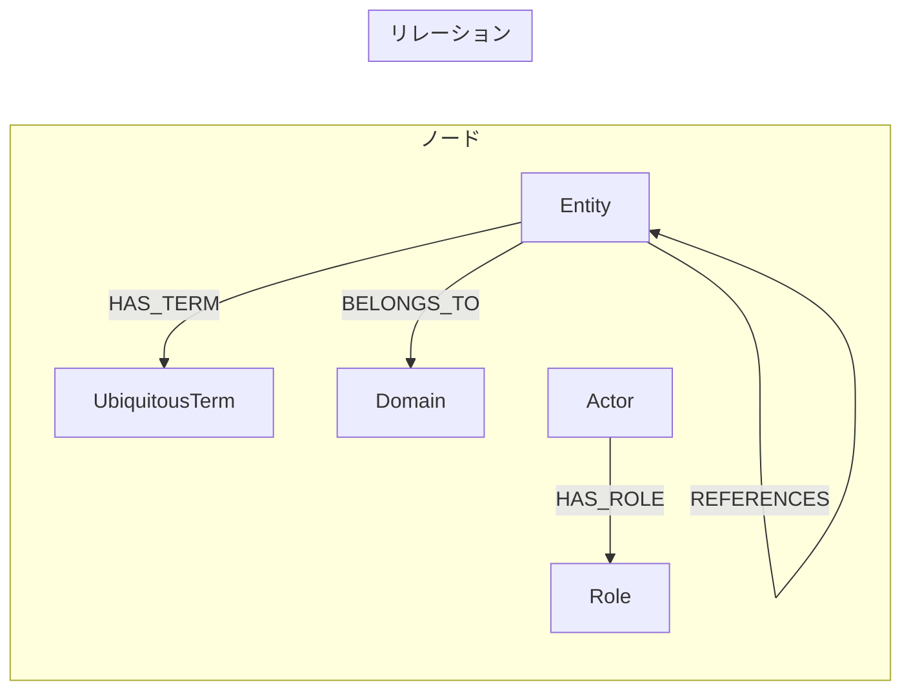

# GraphDB スキーマ

## 概要

Scalar Auditor for BOXシステムのナレッジグラフスキーマです。

## ノードテーブル

### UbiquitousTerm (ユビキタス言語用語)

| プロパティ | 型 | 説明 |
|-----------|-----|------|
| name | TEXT (PK) | 英語名 |
| name_ja | TEXT | 日本語名 |
| definition | TEXT | 定義 |
| domain | TEXT | 所属ドメイン |

### Domain (ドメイン)

| プロパティ | 型 | 説明 |
|-----------|-----|------|
| name | TEXT (PK) | ドメイン名 |
| type | TEXT | Core/Supporting/Integration |
| description | TEXT | 説明 |

### Entity (エンティティ)

| プロパティ | 型 | 説明 |
|-----------|-----|------|
| name | TEXT (PK) | クラス/インターフェース名 |
| file_path | TEXT | ファイルパス |
| type | TEXT | class/interface |
| package | TEXT | パッケージ名 |

### Actor (アクター)

| プロパティ | 型 | 説明 |
|-----------|-----|------|
| name | TEXT (PK) | アクター名 |
| type | TEXT | internal/external |
| description | TEXT | 説明 |

### Role (ロール)

| プロパティ | 型 | 説明 |
|-----------|-----|------|
| name | TEXT (PK) | ロール名 |
| level | TEXT | system/collaborator |
| permissions | TEXT | 権限リスト |

## リレーションテーブル

### BELONGS_TO (Entity → Domain)

エンティティがどのドメインに属するかを表す関係。

### HAS_TERM (Entity → UbiquitousTerm)

エンティティがユビキタス言語の用語と関連することを表す関係。

### HAS_ROLE (Actor → Role)

アクターが持つロールを表す関係。

### REFERENCES (Entity → Entity)

エンティティ間の参照関係。

| プロパティ | 型 | 説明 |
|-----------|-----|------|
| relation_type | TEXT | owned_by/belongs_to/uses/references等 |

## グラフモデル図



## クエリ例

### ドメインに属するエンティティを取得

```cypher
MATCH (e:Entity)-[:BELONGS_TO]->(d:Domain {name: 'Audit'})
RETURN e.name, e.file_path
```

### 用語に関連するエンティティを取得

```cypher
MATCH (e:Entity)-[:HAS_TERM]->(t:UbiquitousTerm {name: 'AuditSet'})
RETURN e.name, t.name_ja
```

### アクターのロールを取得

```cypher
MATCH (a:Actor)-[:HAS_ROLE]->(r:Role)
RETURN a.name, r.name, r.permissions
```

### エンティティの参照関係を取得

```cypher
MATCH (e1:Entity)-[r:REFERENCES]->(e2:Entity)
WHERE e1.name = 'AuditSetService'
RETURN e1.name, r.relation_type, e2.name
```

---

*Generated: 2025-12-26*
*Source: Scalar Auditor for BOX*
